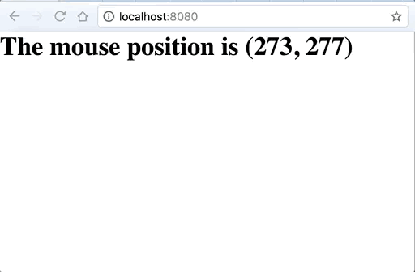

# vue-jsx-render-props

> Example vuejs render props example. Built just to see what it would look like to utilize this pattern on vue using the example laid out in this post: https://cdb.reacttraining.com/use-a-render-prop-50de598f11ce

* [Codesandbox demo](https://codesandbox.io/s/5vxn0nzj0l)



## Build Setup

```bash
# install dependencies
yarn install

# serve it hot at localhost:8080
yarn dev
```
